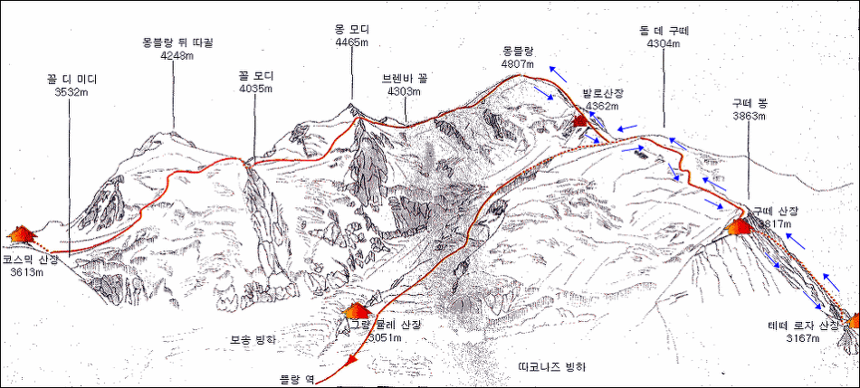

# MontBlanc
* 4807m
* 7월1일 출발
* 구떼 노말루트
# 구떼루트(노멀루트, The Gouter route)

- SaintGervais - Nid d'Aigle - Tete Rousse - Aiguille du Gouter (Gouter hut) - Dome duGouter - Vallot - Arete des Bosses - Mont-Blanc
구떼루트는 가장 많이 이용하는 루트이고, 타 루트에 비하여 다소 쉬운 루트이다. 레 우쉬(Les Houches)에서 벨뷔(Bellevue, 1794m)까지는 케이블카를 타고 오르고, 벨뷔에서 니데글(Nid d'Aigle,2372m)까지는 산악열차(Tram)를 주로 이용한다. 벨뷔에서 걸어서 떼떼 산장으로 가는 팀도 있다. 생 제르배(Saint-Gervais)에서 Tram을 타고 바로 니데글로 올라가갈 수도 있다. 니데글에서 구떼 산장(3817m)까지 오르는 데는 약 5시간 정도 소요된다. 구떼 산장에서 1박을 하고 오전 3시에 정상 공격을 한다. 대체적으로 동이 터올 무렵이면 정상에 도착할 수 있다.

### 장점  
 - 구떼산장에서 정상까지 해발 고도 990m만 오르면 된다
 - 나이프리지 구간이 조금 위험하기는 하지만 기술적으로 가장 쉬운 루트다
 - 등반가들이 가장 많이 이용하는 루트이다

### 단점  
 - 여름에는 매우 붐빈다
 - 산장이 혼잡하고 쾌적하지 않다(사전 예약 필요)
 - Goûter corridor에서 낙석 위험이 있다
 - bosses ridge는 가파르고 얼어 있을 수 있다

# 몽블랑 유튜브
* [유튜브: 세계의 산 몽블랑 44분](https://youtu.be/O8wmxH6spME)

## 등반루트소개
* [몽블랑 등반](https://blog.naver.com/ljkim65/220929517533)
* [몽블랑 등반루트 소개] (https://m.blog.naver.com/alsgh5015/221530827316)
* [몽블랑 등정](http://blog.daum.net/yoosoon333/8110723)
* 등반루트

# 등반계획

2020 왕골창립50주년 기념 몽블랑등반 추진 계획

2020 왕골산악회 창립50주년 기념 몽블랑등반계획을 공유하오니 참가자는 계획을 숙지하시고 행사가 원활하게 진행될 수 있도록 협조 부탁드립니다.

1. 일 정 : 2020. 07.01~07.11

2. 참여인원 : 10명

3. 총 경비 : 4,000만원(400만원/1인)
1) 개인여행자 보험(나이별로 편차가 너무 심함), 입출국 당일 자택에서 인천공항 왕복 교통비는 총 경비에 포함되어 있지 않습니다.
2) 100리터 카고백은 경비에서 제작하여 지급합니다.

4. 협조사항
1) 여권사본 사진이 나오는 면 전체를 복사하여 1월 20일까지 제 이메일(hss3109@hanmail.net)이나 카톡으로 보내주시기 바랍니다.여권은 7월1일 기준 3개월 이상의 유효기간이 남아 있어야합니다.(첨부 사진 참조)
2) 등반 예약을 위한 필요경비(비행기, 산장, 샬레) 200만원을 1월 20일가지 제 계좌로 송금해주시기 바랍니다. 나머지 경비 200만원은 6월 10일까지 송금해주시면 됩니다.
국민은행
606 21 0877510
하삼수

4. 훈련 일정은 추후 공지하겠습니다.

5. 첨 부
1) 2020 왕골산악회 50주년기념 몽블랑등반 일정표
2) 2020 왕골산악회 50주년기념 몽블랑등반 예산안
3) 개인장비 목록
4) 여권사진 샘플
